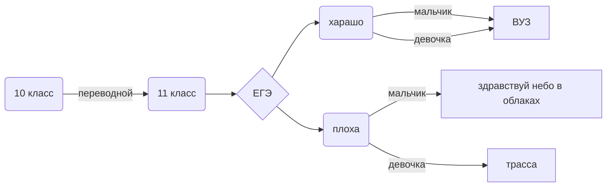

 Козлова Карина 122
 
 evgrfg.github.io
 
 codepen.io/evgrfg
 
 https://evgrfg.wordpress.com
 
 https://openprocessing.org/user/344115
 
 всё.xlsx - все работы в Excel
 
 из 10 в другую.py - перевод из десятичной системы счисления в какую-либо другую
 
 база данных.py - прога по базе данных
 
 из другой в 10.py - перевод из какой-либо системы счисления в десятичную
 
 морзе.py- перевод слова на язык морзе
 
 перевод в системы счисления.py - перевод из любой системы счисления в любую систему счисления
 
 таблица умножения.py - таблица умножения для -ичной системы счисления
 
 папка turtle - работа в черепахе
 
 код хемминга.py - работа с кодом хемминга
 
 7 закон идемпотентности
 
 $$ A\wedge A = A $$
 
 $$ A\vee  A = A $$
 
 
 
 
 |номер задачи| статус |
| ------ | ------ |
|1.| 58 |
|2.| 45 |
|3.| решено |
|4.| решена |
|5.|  |
|6.|  |
|7.|  |
|8.|  |
|9.|  |
|10.| |
|11.| |
|12.| |
|13.| |
|14.| |
|15.| |
|16.| |
|17.| |
|18.| |
|19.| |
|20.| |
|21.| |
|22.| |
|23.| |

$$ \overline{E}_0^{2}= \sqrt{\frac{Fa_0^{2}}{(x-1)\cdot{x}}}+\alpha_1^{2}+\beta_1^{2} $$

